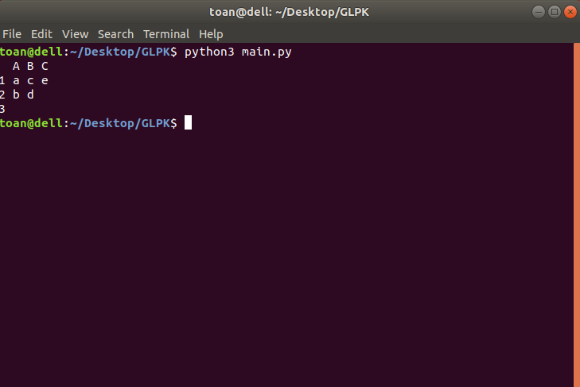

# GLPK
### INSTALL
```sudo apt-get install glpk-utils libglpk-dev glpk-doc```
### RUN
```python3 main.py```
Chương trình sẽ thực thi `problem.mod` sau đó ghi kết quả vào `result.txt`.
Chương trình sẽ đọc kết quả từ `result.txt`và in ra màn hình theo dạng
| | Room1 | Room2 | ...
--- | --- | --- | ---
Time1 | | Tên lớp học phần | ...
Time2 | | | ...
...
### EXAMPLE

